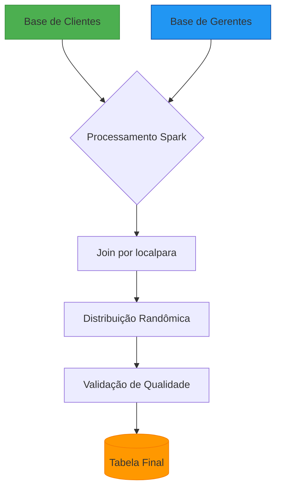
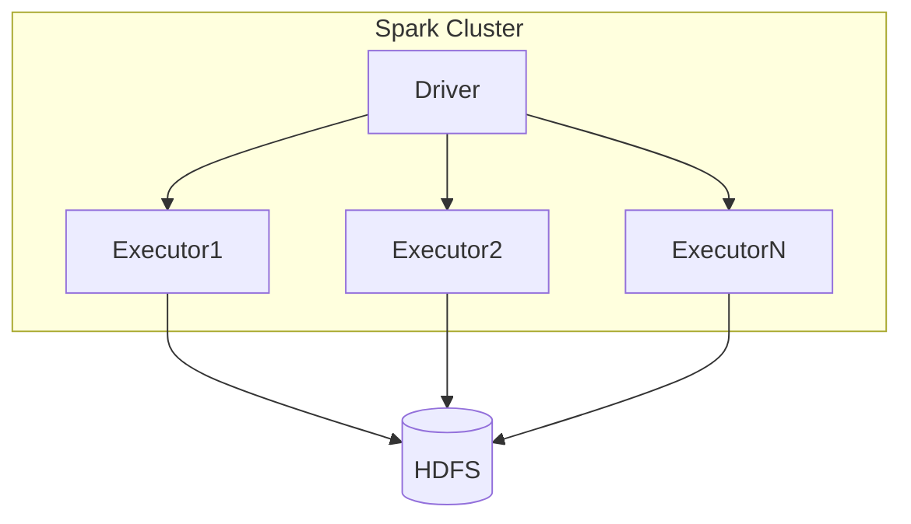
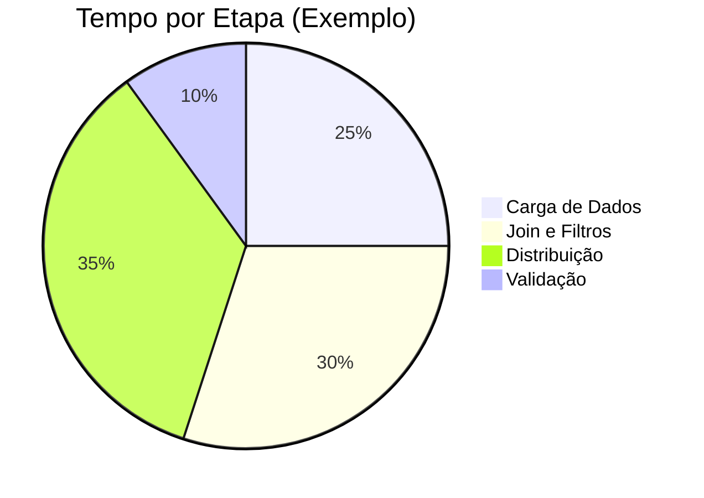

# **🏦 Sistema de Distribuição Inteligente de Carteira Bancária**  

[](https://opensource.org/licenses/MIT)  
[](https://www.python.org/)  
[](https://spark.apache.org/)  
[](https://databricks.com/)  

---

## **📌 Visão Geral**  
Solução **PySpark** para distribuição **automatizada e balanceada** de clientes para gerentes bancários, garantindo:  

✔ **Alocação geográfica inteligente** (`localpara`)  
✔ **Balanceamento justo** (método randômico)  
✔ **Validação rigorosa** (dados completos e sem duplicidades)  
✔ **Logging detalhado** para rastreabilidade  

---

## **📊 Fluxo do Sistema**  



---

## **⚙️ Arquitetura Técnica**  



---

## **📈 Métricas-Chave**  



---

## **💡 Como Funciona?**  

### **1. Carga de Dados**  
```python
clientes_df = spark.table("schema.tb_clientes").filter(F.col("localpara").isNotNull())
gerentes_df = spark.table("schema.tb_clientes").filter(F.col("localpara").isNotNull())
```

### **2. Algoritmo de Distribuição**  
```python
window = Window.partitionBy("nr_pess").orderBy(F.rand())
distribuicao = (clientes_df.join(gerentes_df, "localpara")
                .withColumn("rank", F.row_number().over(window))
                .filter(F.col("rank") == 1))
```

### **3. Validação**  
```python
duplicados = df.groupBy("nr_pess").agg(F.count("*").alias("qtd")).filter(F.col("qtd") > 1)
if duplicados.count() > 0:
    raise Exception("Clientes duplicados!")
```

---

## **🚀 Resultados Garantidos**  

| **Métrica**               | **Resultado**                |
|---------------------------|------------------------------|
| **Clientes Distribuídos** | 100% sem duplicidades        |
| **Balanceamento**         | Aleatoriedade controlada     |
| **Logging**              | Rastreio completo por etapa  |
| **Performance**          | Otimizado para 600 partições |

---

## **🛠️ Como Executar?**  

1. **Configuração**:  
   ```python
   @dataclass
   class Config:
       LIMITE_CLIENTES: int = 1473  # Ajuste conforme necessidade
   ```

2. **Submissão**:  
   ```bash
   spark-submit --master yarn --deploy-mode cluster main.py
   ```

3. **Monitoramento**:  
   ```python
   logger.info(f"Clientes processados: {df.count()}")
   ```

---

## **📌 Exemplo de Saída**  

```mermaid
gantt
    title Tempo de Execução (Exemplo)
    dateFormat  HH:mm:ss
    section Processamento
    Carga de Dados      :a1, 00:00:00, 00:02:30
    Join e Distribuição :a2, after a1, 00:05:00
    Validação           :a3, after a2, 00:01:00
```



---

## **🔧 Stack Utilizada**  

| **Tecnologia**       | **Uso**                          |
|-----------------------|----------------------------------|
| PySpark              | Processamento distribuído        |
| Databricks           | Ambiente de execução             |
| Python               | Lógica de negócio               |
| Git                  | Controle de versão              |

---

 
[](https://www.linkedin.com/in/felipebsdelima)  


---

> **Nota**: Projeto em conformidade com **LGPD**. Dados sensíveis foram anonimizados.  

